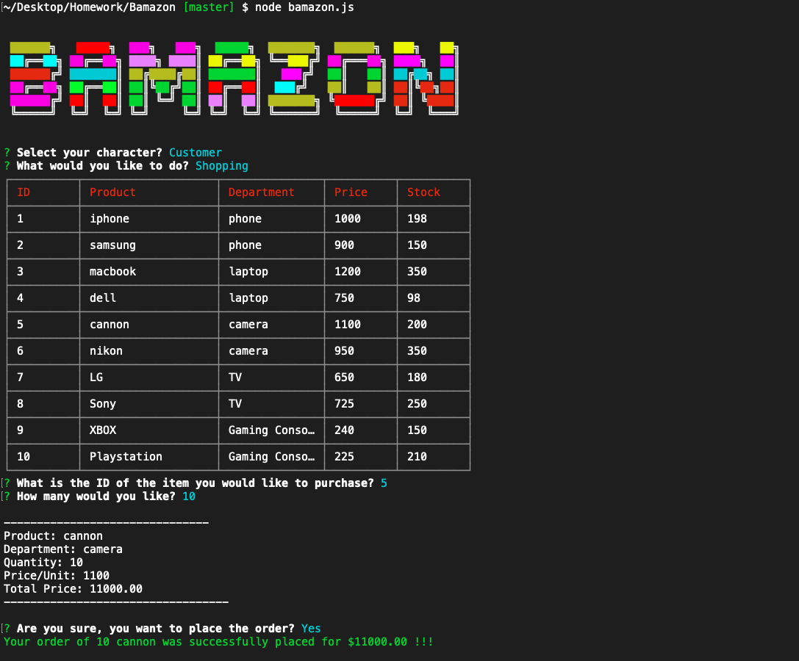

# Bamazon

## Description

This application implements a simple command line based storefront using the npm [inquirer](https://www.npmjs.com/package/inquirer) package and the MySQL database backend together with the npm [mysql](https://www.npmjs.com/package/mysql) package. The application presents two interfaces: **customer**

## Bamazon in Action:

## Images Of Bamazon

## Frontend 
* HTML
* CSS
* Bootstrap (http://getbootstrap.com/)
* Javascript
* jQuery (https://jquery.com/)

## Backend 
* Node.js (https://nodejs.org/en/)
* MySQL (https://www.mysql.com/)

## License
Standard MIT License

## Author
Minal Kharche